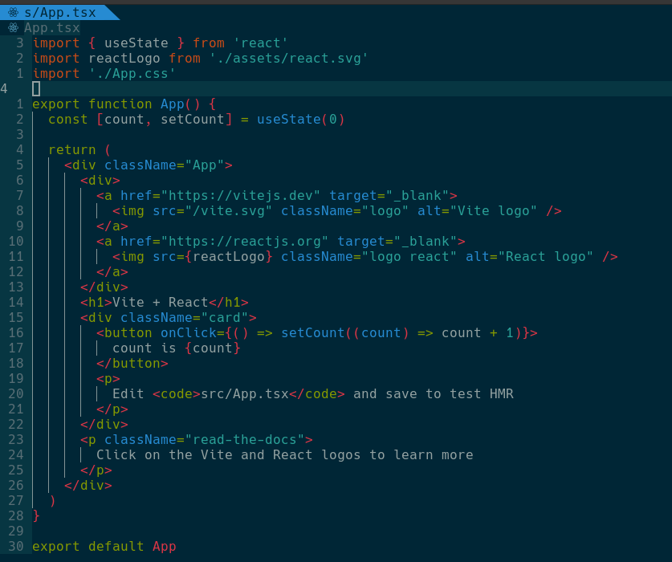
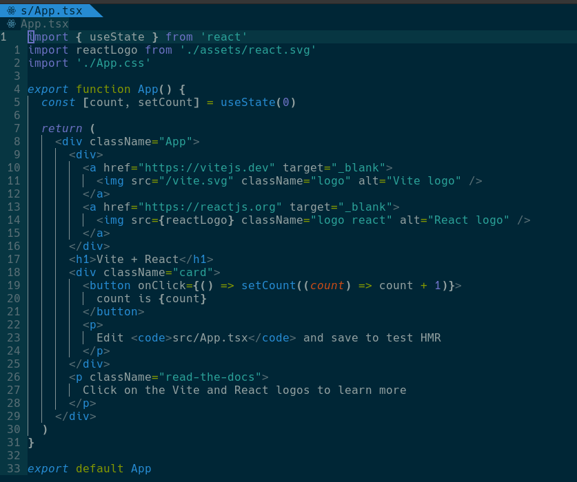
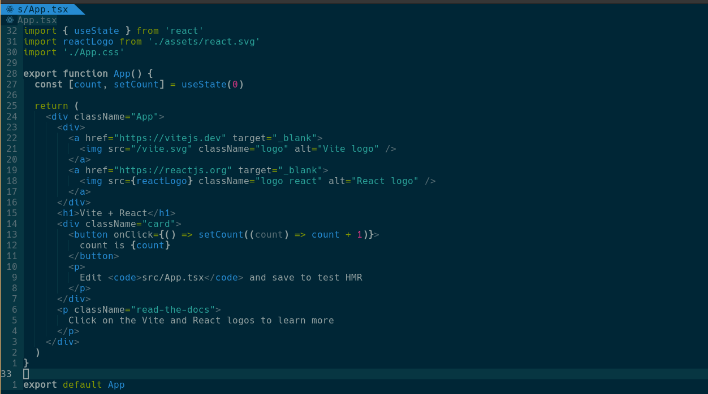

## Solarized Colorscheme for Neovim

Designed By [Ethan Schoonover](https://github.com/altercation) <br />
Developed By [Max](https://github.com/maxmx03)

## [Visit The Solarized homepage](https://ethanschoonover.com/solarized/)

## Screenshots


## Themes

### *Vim*


### *Neovim*


### *Vscode*



## Installation

via [Packer](https://github.com/wbthomason/packer.nvim)
```lua
use {
  'maxmx03/solarized.nvim',
  config = function ()
    local success, solarized = pcall(require, 'solarized')

    if not success then
      return
    end

    solarized.setup()
  end
}
```

via [vim-plug](https://github.com/junegunn/vim-plug)

```vim
Plug 'maxmx03/solarized.nvim'
```
## How to Config

example
```lua
local success, solarized = pcall(require, 'solarized')

if not success then
  return
end

vim.g.solarized_comments_italic = true
vim.g.solarized_functions_italic = false
vim.g.solarized_keywords_italic = true
vim.g.solarized_comments_bold = false
vim.g.solarized_keywords_bold = false
vim.g.solarized_functions_bold = false

local config = {
  mode = 'dark', -- dark(default)/light
  theme = 'vim', -- vim(default)/neovim/vscode
  transparent = false, -- false(default)/true
  -- override colors
  colors = {
    bg_alt = '#333333',
  },
  -- override highlight
  highlights = {
    Normal = { fg = '#fafafa', bg = '#000000' },
    NormalNC = { fg = '#ff8f81', bg = '#333333' },
  },
  -- override highlight with function, colors also can be a function
  highlights = function(colors)
    return {
      Normal = { fg = colors.cyan, bg = colors.bg_alt },
      NormalNC = { fg = colors.cyan, bg = colors.bg_alt },
    }
  end,
}

solarized.setup(config)

vim.cmd 'colorscheme solarized'
```
